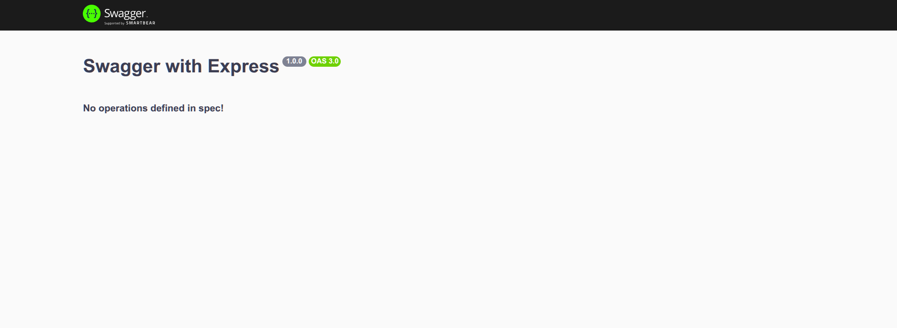
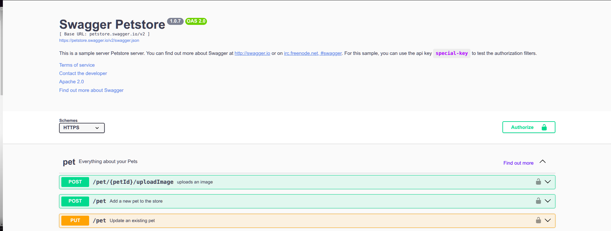

# Fazendo documentações de apis Express com Swagger

Baixe a biblioteca Swagger UI Express:

```
npm install swagger-ui-express
```

crie na raiz do projeto um arquivo chamado swwagger.json ou swwagger.yaml e coloque uma chave vazia em seu conteúdo:

```json
swagger.json
{}
```

Importe em server.js o swaggerUi:

```js
const express = require("express");
const app = express();

const swaggerUi = require("swagger-ui-express"); //commonjs
// ou
//import swaggerUi from "swagger-ui-express"; //ES6
```

Adicione o middleware do swagger:

```js
app.use("api-docs", swaggerUi.serve, swaggerUi.setup(require("./swagger")));

//Ou para melhor legibilidade:

const swaggerDocs = require("./swagger.json");
app.use("api-docs", swaggerUi.serve, swaggerUi.setup(swaggerDocs));
```

Visite _http://localhost:3000/api-docs/_ e vera algo proximo a isso:

<p align="center">
    
</p>

Como não temos nenhuma definição até o momento a documentação ainda não estará acessível, adicione agora o cabeçalho de nossa documentação acesse novamente http://localhost:3000/api-docs/:

```json
{
  "openapi": "3.0.0",
  "info": {
    "title": "Swagger with Express",
    "description": "Essa api tem como objetivo demonstra o uso do swagger com express",
    "version": "1.0.0"
  }
}
```

Vera algo proximo a isso:

<p align="center">
    
</p>

O swagger também possui uma documentação de test que pode ser acessada em https://petstore.swagger.io/ é assim que queremos que nossa documentação de api fique ao final do projeto

<p align="center">
    
</p>

Podemos também acessar o json utilizado para gerar essa documentação em https://petstore.swagger.io/v2/swagger.json

Agora vamos deixar essa cabeçalho um pouco mais completo, iremos adicionar uma rota de acesso aos termos de uso de nossa api que poderá ser disponibilizada através de uma pagina estática fornecida pelo servido ou uma rota a parte, também colocaremos um contato de referencia

```json
    "openapi": "3.0.0",
    "info": {
        "title": "Swagger with Express",
        "description": "Essa api tem como objetivo demonstra o uso do swagger com express",
        "version": "1.0.0",
        "termsOfService": "http://localhost:3000/terms/",
        "contact": {
            "name": "Davi Cândido",
            "email": "davicandidopucminas@gmail.com"
        }
    },
```

Em seguida vamos informar quais urls nossa Api estará disponibilizada

```json
    "servers": [{
        "url": "http://localhost:3000/v1",
        "description": "Ambiente de desenvolvimento"
     },{
        "url": "www.crudJourney.com/v2",
        "description": "Ambiente de produção"
     }
    ]
```

Agora iremos fazer um mapeamento de todas as rotas presente ou que futuramente estarão presentes em nossa api, vamos iniciar mapeando a rota de primeira rota de get:

```json
"paths": {
        "/posts":{
            "sumarry": "Retorna todos os posts",
            "description": "Essa rota será responsável por retorna todos os posts",
            "get": {
                "tags": ["Posts"],
                "responses": {
                    "200": {
                        "description": "Retorna todos os posts"
                    },
                    "404": {
                        "description": "Nenhum post foi encontrado"
                    }
                }
            }
        }
}
```

Para post teremos um tratamento um pouco diferente, teremos uma propriedade chamada _requestBody_ que será responsável por dizer o tipo de dado requerido, que no nosso caso é o application/json, que por sua vez conterá o schema, ou seja o esquema referente ao formato como esses dados devem ser enviados, com seus atributos e tipos, veja que o esquema e feito através de um componente que é referenciado através do _$ref_, o esquema em sí foi definido em "componentes":

```json
    "post": {
        "summary": "Cria um post",
        "description": "Essa rota cria um post",
        "tags": ["Posts"],
        "requestBody": {
          "content": {
            "application/json": {
              "schema": {
                "$ref": "#/components/schemas/Post"
              },
              "examples": {
                "post": {
                  "value": {
                    "title": "Post 1",
                    "content": "Conteudo do post 1"
                  }
                }
              }
            }
          }
        },
        "responses": {
          "201": {
            "description": "Post criado com sucesso"
          },
          "404": {
            "description": "Dados incorretos ou incompletos"
          }
        }
      }
    }
  },
  "components": {
    "schemas": {
      "Post": {
        "type": "object",
        "required": ["title", "content"],
        "properties": {
          "id": {
            "type": "number"
          },
          "title": {
            "type": "string"
          },
          "content": {
            "type": "string"
          }
        }
      }
    }
  }
```
